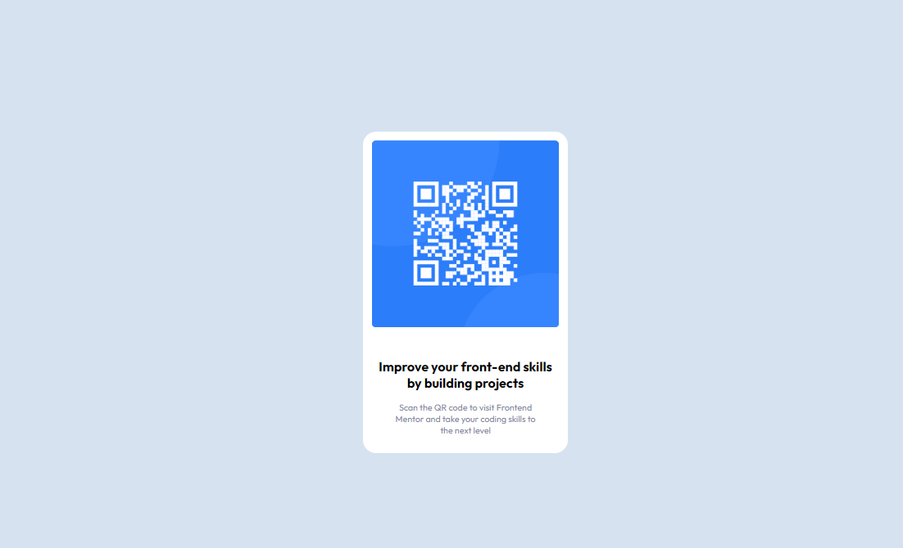

# Frontend Mentor - QR code component solution

This is a solution to the [QR code component challenge on Frontend Mentor](https://www.frontendmentor.io/challenges/qr-code-component-iux_sIO_H)

## Table of contents

- [Screenshot](#screenshot)
- [Links](#links)
- [Built with](#built-with)
- [What I learned](#what-i-learned)
- [Author](#author)

### Screenshot



### Links

- Solution URL: (https://www.frontendmentor.io/solutions/qrcodecomponet-using-flex-box-pZT0rGzTgL)
- Live Site URL: (https://qrcode-componet-f7869f.netlify.app/)

### Built with

- Semantic HTML5 markup
- CSS custom properties
- Flexbox

### What I learned

- i learned about VH(view height) and VW(view width) CSS units which are relative to the visible screen size and how to use it

for example

```css
.container {
  height: 100vh;
  //100 vh - the elements take 100% of the viewport height-wise
}
```

- also i learned about the box-sizing CSS property and used it in the challenge

### Useful resources

- (https://developer.mozilla.org/en-US/docs/Web/CSS/box-sizing) - This helped me for learning about the box-sizing property
- (https://blog.webdevsimplified.com/2022-08/css-viewport-units/) - This is an amazing article which helped me to understand CSS veiwport units. I'd recommend it to anyone still learning this concept.

## Author

- Frontend Mentor - (https://www.frontendmentor.io/profile/abdelrahmanm18)
- Linkedin - (https://www.linkedin.com/in/abdelrahman-fekry-185431199/)
